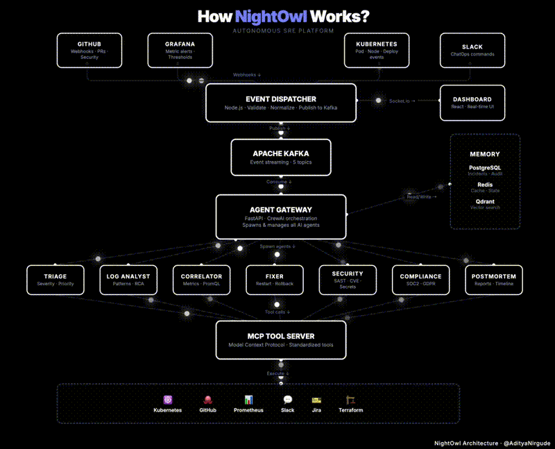

# 🦉 NightOwl — Autonomous SRE Platform

> AI-powered platform that detects, diagnoses, fixes, and documents infrastructure incidents automatically using multi-agent orchestration.

## Architecture



> 🎬 **[View Full Interactive Diagram](https://aditya153.github.io/NightOwl-SRE-Platform/docs/diagrams/architecture-animated.html)**

## Tech Stack

| Layer | Technology |
|-------|------------|
| AI Gateway | FastAPI + CrewAI + LangChain |
| Event Handler | Node.js + Express + Socket.io |
| LLM | OpenRouter |
| Tools | MCP Protocol (Model Context Protocol) |
| Queue | Apache Kafka |
| Cache | Redis |
| Database | PostgreSQL |
| Vector DB | Qdrant |
| Frontend | React + Vite |
| Monitoring | Prometheus + Grafana |
| Container | Docker + Kubernetes |

## How It Works

1. **Event Sources** (GitHub, Grafana, Kubernetes, Slack) emit events
2. **Event Dispatcher** validates, normalizes, and publishes events to Kafka
3. **Agent Gateway** consumes events and orchestrates AI agents via CrewAI
4. **AI Agents** (Triage, Log Analyst, Correlator, Fixer, Security, Compliance) analyze and resolve incidents
5. **MCP Tool Server** provides standardized tool access to infrastructure (K8s, GitHub, Prometheus, etc.)

## Development Progress

- [x] Phase 1: Architecture & Documentation
- [x] Phase 2: Agent Gateway (FastAPI + CrewAI)
- [ ] Phase 3: Event Dispatcher (Node.js)
- [ ] Phase 4: MCP Tool Server
- [ ] Phase 5: AI Agents
- [ ] Phase 6: Frontend Dashboard
- [ ] Phase 7: Observability & Monitoring
- [ ] Phase 8: CI/CD & Deployment

## Getting Started

```bash
git clone https://github.com/aditya153/NightOwl-SRE-Platform.git
cd NightOwl-SRE-Platform
```

> 🚧 Project is actively being built. Follow the journey on [LinkedIn](https://linkedin.com).

## License

MIT
